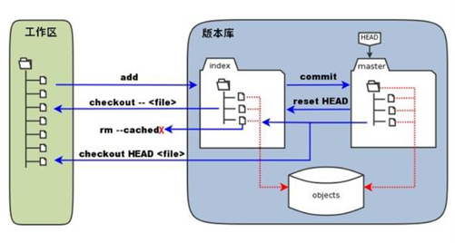

* [Intro](#intro)
  * [Git 相关概念与工作流程](#git-%E7%9B%B8%E5%85%B3%E6%A6%82%E5%BF%B5%E4%B8%8E%E5%B7%A5%E4%BD%9C%E6%B5%81%E7%A8%8B)
* [从获取源文件到提交修改的全过程](#%E4%BB%8E%E8%8E%B7%E5%8F%96%E6%BA%90%E6%96%87%E4%BB%B6%E5%88%B0%E6%8F%90%E4%BA%A4%E4%BF%AE%E6%94%B9%E7%9A%84%E5%85%A8%E8%BF%87%E7%A8%8B)
  * [纯代码的形式](#%E7%BA%AF%E4%BB%A3%E7%A0%81%E7%9A%84%E5%BD%A2%E5%BC%8F)
    * [Git Account Config](#git-account-config)
    * [Get or Create Files for the Project](#get-or-create-files-for-the-project)
    * [Connect Local &amp; Remote Repos](#connect-local--remote-repos)
    * [Connect Branches](#connect-branches)
    * [Edit Files, Commit to Local Repo, and Push to Remote Repo](#edit-files-commit-to-local-repo-and-push-to-remote-repo)
    * [Version Rollback](#version-rollback)
  * [手动下载zip文件的形式](#%E6%89%8B%E5%8A%A8%E4%B8%8B%E8%BD%BDzip%E6%96%87%E4%BB%B6%E7%9A%84%E5%BD%A2%E5%BC%8F)
    * [Init](#init)
    * [Connect to Remote Repo](#connect-to-remote-repo)
    * [Pull &amp; Push](#pull--push)
* [Fork / Pull Request](#fork--pull-request)

# Intro
可参考的官方文档： <br/>
https://docs.github.com/cn/free-pro-team@latest/github/using-git <br/>
https://git-scm.com/book/zh/v2 <br/>

可参考的个人文档： <br/>
https://blog.csdn.net/qq_35246620/article/details/66973794 <br/>
https://www.liaoxuefeng.com/wiki/896043488029600 <br/>
https://edu.aliyun.com/course/489

Cheatsheet： <br/>


## Git 相关概念与工作流程


工作区：就是你在电脑里能看到的目录。 <br/>
暂存区：英文叫stage, 或index。一般存放在 ".git目录下" 下的index文件（.git/index）中，所以我们把暂存区有时也叫作索引（index）。 <br/>
版本库：工作区有一个隐藏目录.git，这个不算工作区，而是Git的版本库。



图中左侧为工作区，右侧为版本库。在版本库中标记为 "index" 的区域是暂存区（stage, index），标记为 "master" 的是 master 分支所代表的目录树。 <br/>
可以看出此时 "HEAD" 实际是指向 master 分支的一个"游标"。所以图示的命令中出现 HEAD 的地方可以用 master 来替换。 <br/>
图中的 objects 标识的区域为 Git 的对象库，实际位于 ".git/objects" 目录下，里面包含了创建的各种对象及内容。 <br/>

当对工作区修改（或新增）的文件执行 "git add" 命令时，暂存区的目录树被更新，同时工作区修改（或新增）的文件内容被写入到对象库中的一个新的对象中，而该对象的ID被记录在暂存区的文件索引中。 <br/>
当执行提交操作（git commit）时，暂存区的目录树写到版本库（对象库）中，master 分支会做相应的更新。即 master 指向的目录树就是提交时暂存区的目录树。 <br/>
当执行 "git reset HEAD" 命令时，暂存区的目录树会被重写，被 master 分支指向的目录树所替换，但是工作区不受影响。 <br/>
当执行 "git rm --cached <file>" 命令时，会直接从暂存区删除文件，工作区则不做出改变。 <br/>
当执行 "git checkout ." 或者 "git checkout -- <file>" 命令时，会用暂存区全部或指定的文件替换工作区的文件。这个操作很危险，会清除工作区中未添加到暂存区的改动。 <br/>
当执行 "git checkout HEAD ." 或者 "git checkout HEAD <file>" 命令时，会用 HEAD 指向的 master 分支中的全部或者部分文件替换暂存区和以及工作区中的文件。
这个命令也是极具危险性的，因为不但会清除工作区中未提交的改动，也会清除暂存区中未提交的改动。 <br/>


# 从获取源文件到提交修改的全过程

## 纯代码的形式

### Git Account Config
config可以存放在以下三个不同的地方：
1. /etc/gitconfig文件：系统中对所有用户都普遍适用的配置。若使用git config时用--system选项，读写的就是这个文件。
2. ~/.gitconfig文件：用户目录下的配置文件只适用于该用户。若使用git config时用--global选项，读写的就是这个文件。
3. 当前项目的Git目录中的配置文件（也就是工作目录中的.git/config文件）：这里的配置仅仅针对当前项目有效。
每一个级别的配置都会覆盖上层的相同配置，所以.git/config里的配置会覆盖/etc/gitconfig中的同名变量。
在Windows系统上，Git会找寻用户主目录下的.gitconfig文件。主目录即$HOME变量指定的目录，一般都是 C:\Documents and Settings\$USER。
此外，Git还会尝试找寻/etc/gitconfig文件，只不过看当初Git装在什么目录，就以此作为根目录来定位。

查看config：
```
git config -l/--list
git config user.name
git config user.email
```

修改config：
```
git config --global user.email "theEmail@example.com"
git config --global user.name "theNickname"
```
Example: AndrewEmail, kaleido97

### Get or Create Files for the Project
```
cd whereYouWantToCreateThisProject
git init
git clone urlOfRemoteRepo
```

这里clone或可改为：
```
git remote add origin urlOfRemoteRepo    # 将本地关联至远程repository，并将远程repo简称为origin
git pull origin branchRemote:branchLocal # 从origin的branchRemote分支中拉取内容至本地branchLocal分支
```

### Connect Local & Remote Repos
```
git remote add origin urlOfRemoteRepo    # 将本地关联至远程repository，并将远程repo简称为origin
git remote 
git remote -v
git remote show origin
```

### Connect Branches
```
git checkout -b / switch -c newBranchLocal      # 在本地创建并切换至新分支
(Same as: git branch newBranchLocal + git checkout/switch newBranchLocal)
(git checkout branchLocal origin/branchRemote   # 如果远程有某一个分支而本地没有，该命令将远程的分支迁到本地)
git branch / branch -r / branch -a		        # 查看本地/远程/所有分支
（如果之前从未commit过，则看不到branch信息）

git branch --set-upstream-to=origin/branchRemote branchLocal	# 关联本地及远程分支
# 此步用于如果git pull提示no tracking information，说明本地分支和远程分支的链接关系没有创建
```

### Edit Files, Commit to Local Repo, and Push to Remote Repo 
```
<edit those files>
git status                          # 查看当前文件状态（是否add、commit等）
git add * <or fileName>             # *表示所有文件，类似*.js表示所有js文件
git ls-files                        # 列出所有跟踪的文件名
git commit -m "Changes for files"   
git push                            # 适用于之前关联过本地与远程分支后

(Otherwise:)
git push -u origin branchRemote
---------------
git push origin localBranchName:remoteBranchName
---------------
# 由于远程库是空的，我们第一次推送branchLocal分支时，加上了-u参数，
# Git不但会把本地的branchLocal分支内容推送到远程的新的branchRemote分支，
# 还会把本地的branchLocal分支和远程的branchRemote分支关联起来，
# 在以后的推送或者拉取时就可以简化命令。

git push --set-upstream origin branchRemote # 若之前push时未加-u，则可之后再通过--set-upstream来关联本地及远程
```

push后可能会出现冲突，terminal提示需要先pull。 <br/>
pull之前可以stash暂时存储本地修改，在pull之后再unstash：
```
git stash save -a "stashName"
git pull
git stash apply "stashName"
git push
```

关于stash：
```
Ref: https://www.cnblogs.com/tocy/p/git-stash-reference.html
git stash save -a "stashName"   # 创建stash，-a表示stash当前目录下的所有修改，包括untracked files和ignored files
git stash list                  # 查看当前的所有stash
git stash show <stashName>      # 查看指定stash中对文件更改的情况
git stash show <stashName> -p   # 查看指定stash中对文件更改的详细情况

git stash pop <stashName>       # 应用stash并删除
git stash apply <stashName>     # 应用stash但不删除
git stash drop <stashName>      # 删除名为stashName的stash
git stash clear                 # 清除所有stash

git stash branch newBranch      # 创建一个新的分支保存这部分stash，原分支的stash将被删除
```

若不想通过stash，而是直接修改冲突： <br/>
冲突的查看有多种办法，首先是使用```git diff```，在原文件中找差异然后修改； <br/>
或者在webstorm中用鼠标右键点击文件commit directory，然后点击某个文件查看改动的地方； <br/>
另外还可以使用Beyond Compare等外部程序进行修改。

有时stash也会报错```needs merge```，这时可以粗暴地把需要merge的文件全部剪切出来，add及commit后push，再把剪切的部分粘回来，再次add commit push。

### Version Rollback
实在没办法需要回退版本时，则用：
```
git reset --hard <commit_id>    # 将版本回退到对应的commit_id上，commit id可以git log查看
```


## 手动下载zip文件的形式

若是单独下载的zip文件（即不需clone），未与远程连接过，则应为：

### Init
```
cd locationOfZipFile                            # 初始化Git之前确认项目路径
git init                                        # 初始化Git，创建本地仓库
git checkout -b / switch -c newBranchLocal      # 在本地创建并切换至新分支
```
之后可用```git status, git log / git log --graph```等随时进行调试。

### Connect to Remote Repo
```
git add *                                       # 将对文件的编辑提交至暂存区，*表示全部文件
git commit -m "msg"                             # 将暂存区的修改提交至本地仓库，执行后才会真正生成本地分支

git remote add origin theURL    # 将本地仓库关联至远程仓库，并将远程仓库称为origin
                                # 在第一次commit之前，默认当前branch未创建，所以git remote add是无效的
```

添加remote后可用如下调试：
```
git remote
git remote -v
git remote show origin
```
commit后分支才真正建立，可用```git branch / branch -r/ branch -a```等进行调试。

### Pull & Push
连接远程仓库后，开始向远程仓库push提交修改。push之前需要先pull：
```
git stash save -a "stashName"   # 正常应在pull之前stash本次更改，pull之后再unstash，然后push
                                # 由于本次直接下载了zip源文件，没有在下载前与远程关联，所以这步跳过

git pull origin remoteBranch --allow-unrelated-histories    # 将远程origin仓库中的remoteBranch分支的内容pull下来
                                                            # 由于之前未与远程关联，故需要allow unrelated Git history               
```
pull之后可能会报错，提示有些文件需要merge。 <br/>
由于本次直接下载了zip源文件，没有在下载前与远程关联，故无法使用上述的stash，只能手动修改。

这时则需要输入git diff或使用如Beyond Compare软件对这些文件进行手动修改。 <br/>
输入git diff，摁空格显示更多内容，摁q退出当前diff模式，在原程序文件中”>>>>“间的部分进行修改。

改到没有冲突为止，再push：
```
git push origin localBranch:remoteBranch    # 将本地的localBranch分支的内容推送到远程origin仓库的remoteBranch分支中
```


# Fork / Pull Request
Ref: <br/>
http://www.ruanyifeng.com/blog/2017/07/pull_request.html <br/>
https://github.com/selfteaching/the-craft-of-selfteaching/issues/67

